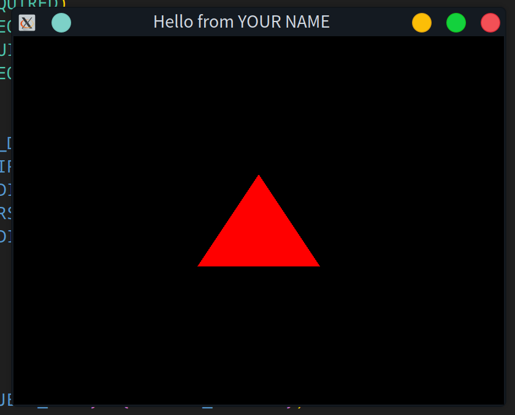
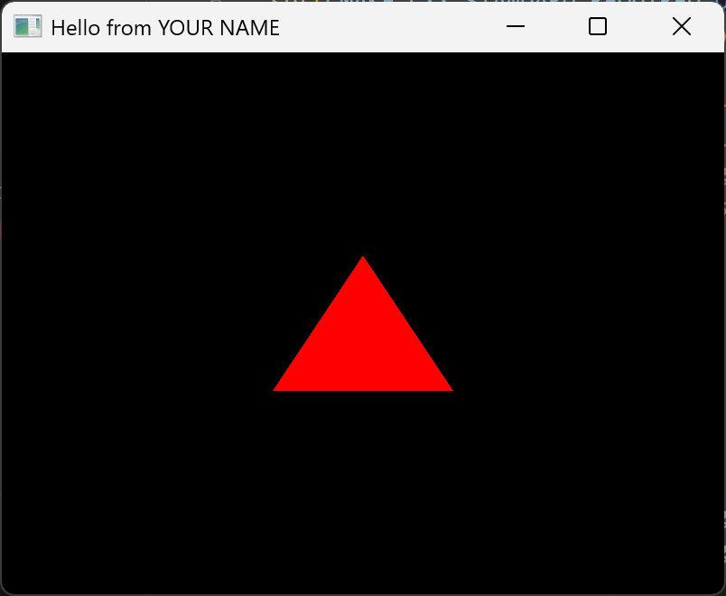

# Linux
## 安装基本编译构建工具和 OpenGL (扩展)库
```bash
sudo apt install build-essential cmake libgl1-mesa-dev libglu1-mesa-dev libglew-dev
```

## 安装 GLFW 库 (需处理)
```bash
sudo apt install libglfw3 libglfw3-dev
```

## 安装 GLM 库
```bash
sudo apt install libglm-dev
```

## 安装 SOIL 库 (需处理)
```bash
sudo apt install libsoil-dev
```

## 修复 GLFW 错误
构建过程中会出现找不到 `GLFW3` 的错误, 查询到这个 [网页](https://www.cnblogs.com/jiujiubashiyi/p/16429717.html) 解决, 需要自己编译

### 安装工具和依赖
```bash
sudo apt-get install libglfw3-dev
sudo apt install libxkbcommon-dev xorg-dev
```

### 编译源码
```bash
git clone https://github.com/glfw/glfw
cd glfw
cmake -S . -B build
cd build
make
sudo make install
```

## 修复 SOIL2 错误
需要自己编译
```bash
git clone https://github.com/SpartanJ/SOIL2.git
cd SOIL2
cmake -S . -B build
cd build
make
sudo make install
```

## 其他修复
### CMake 构建警告
存在传统的 legacy GL 和新的 GLVND 这 2 种 OpenGL 实现但没有指定, 需要在项目的 `CMakeLists.txt` 中指定
```cmake
set(OpenGL_GL_PREFERENCE GLVND)
```

### GLVND 和 SOIL2 "冲突"
需要在 `CMakeLists.txt` 的  `target_link_libraries` 中显示添加依赖 `X11` 和 `GLX`

## 运行结果


---
# Windows
## GLFW 库
到 [官网](https://www.glfw.org/) 进行下载, 可以直接下载预编译的, 这里选择 [64 位最新 (3.4) 版](https://github.com/glfw/glfw/releases/download/3.4/glfw-3.4.bin.WIN64.zip), 解压到存放处

在 `CMakeLists.txt` 中添加路径 `${GLFW_DIR}`, 之后添加头文件 `include_directories("${GLFW_DIR}/include")`, 添加库 `find_library(GLFW_LIBRARY NAMES glfw3 PATHS "${GLFW_DIR}/lib-mingw-w64")`, 链接库 `target_link_libraries(${GLFW_LIBRARY})`, 并找到 `.dll` 文件 `GLFW_DLL`, 以便复制到编译路径

## GLEW 库
到 [官网](https://glew.sourceforge.net/) 进行下载, 可以直接下载预编译的, 这里选择 [最新 (2.1.0) 版](https://sourceforge.net/projects/glew/files/glew/2.1.0/glew-2.1.0-win32.zip/download), 解压到存放处

在 `CMakeLists.txt` 中添加路径 `${GLEW_DIR}`, 之后添加头文件 `include_directories("${GLEW_DIR}/include")`, 添加库 `find_library(GLEW_LIBRARY NAMES glew32 PATHS "${GLEW_DIR}/lib/Release/x64")`, 链接库 `target_link_libraries(${GLEW_LIBRARY})`, 并找到 `.dll` 文件 `GLEW_DLL`, 以便复制到编译路径

## GLM 库
到 [GitHub仓库](https://github.com/g-truc/glm), 克隆项目源码或下载 [最新 (1.0.1) 发布](https://github.com/g-truc/glm/releases/download/1.0.1/glm-1.0.1-light.7z), 解压到存放处

在 `CMakeLists.txt` 中添加路径 `${GLM_DIR}`, 之后添加头文件 `include_directories("${GLM_DIR}")`

## SOIL2 库
到 [GitHub仓库](https://github.com/SpartanJ/SOIL2), 克隆项目源码, 解压到存放处

在 `CMakeLists.txt` 中添加路径 `${SOIL2_DIR}`, 之后添加头文件 `include_directories("${SOIL2_DIR}/src")`, 再添其为子目录 `add_subdirectory(${SOIL2_DIR} ${CMAKE_BINARY_DIR}/soil2)`, 链接库 `target_link_libraries(soil2)`

## 复制 DLL 到编译路径
```cmake
add_custom_command(TARGET ${PROJECT_NAME} POST_BUILD
    COMMAND ${CMAKE_COMMAND} -E copy_if_different
    "${GLFW_DLL}"
    "${GLEW_DLL}"
    "$<TARGET_FILE_DIR:${PROJECT_NAME}>"
    COMMENT "Copying DLLs to output directory"
)

```

## 运行结果

