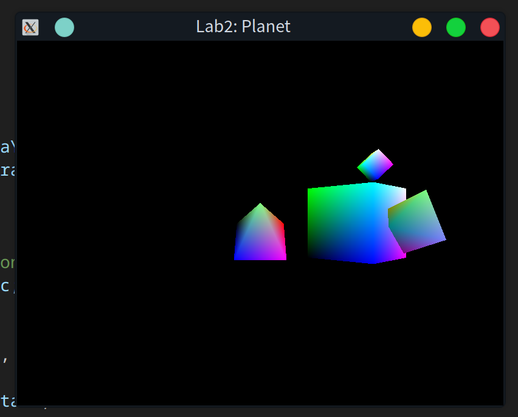

# 任务
1. 修改程序 4.4 以包含第二个 "行星", 使用你自定义的 3D 形状
2. 实现 "行星" 公转自转动画效果, 确保你的新 "行星" 处于与地球不同的轨道上, 使得它们不会碰撞

---

# 运行示例
此程序运行依赖 `C++` 标准库, 否则无法正确运行. `Windows` 下需要额外配置才能正确运行. 可以采用静态链接的方式, 即在 `CMakeLists` 中的 `target_link_libraries` 加入 `-static-libstdc++` (和非必须 `-static-libgcc`). 此处采取动态链接, 找到 `.dll` 文件再拷贝到编译目录 (与其他拷贝 `.dll` 的方式一样, 省略)
```cmake
find_file(GCC_DLL NAMES libgcc_s_seh-1.dll PATHS "${MINGW_DIR}/bin")
find_file(STDCPP_DLL NAMES libstdc++-6.dll PATHS "${MINGW_DIR}/bin")
```

---

# 操作步骤
为了简单起见, 新形状与其他共用一个 `VAO`

## 1. 增加一个 VBO 存储新形状
将 `mian.cpp` 的 `numVBOs` 加一, 即改为 3

## 2. 添加新形状三角面定点数据
为了简单起见, 新形状为正八面体, 使得形状仅由简单的三角面即可精确表示

同其他形状, 在定义定点数据的 `setupVertices` 中:
```cpp
float octahedronPositions[74] =
	{
		1.0f, 0.0f, 0.0f, 0.0f, 1.0f, 0.0f, 0.0f, 0.0f, 1.0f,
		0.0f, 1.0f, 0.0f, -1.0f, 0.0f, 0.0f, 0.0f, 0.0f, 1.0f,
		-1.0f, 0.0f, 0.0f, 0.0f, -1.0f, 0.0f, 0.0f, 0.0f, 1.0f,
		0.0f, -1.0f, 0.0f, 1.0f, 0.0f, 0.0f, 0.0f, 0.0f, 1.0f,
		1.0f, 0.0f, 0.0f, 0.0f, 0.0f, -1.0f, 0.0f, 1.0f, 0.0f,
		0.0f, 1.0f, 0.0f, 0.0f, 0.0f, -1.0f, -1.0f, 0.0f, 0.0f,
		-1.0f, 0.0f, 0.0f, 0.0f, 0.0f, -1.0f, 0.0f, -1.0f, 0.0f,
		0.0f, -1.0f, 0.0f, 0.0f, 0.0f, -1.0f, 1.0f, 0.0f, 0.0f};
```

## 3. 绑定到新的 VBO
同其他形状, 在定义定点数据的 `setupVertices` 中:
```cpp
glBindBuffer(GL_ARRAY_BUFFER, vbo[2]); glBufferData(GL_ARRAY_BUFFER, sizeof(octahedronPositions), octahedronPositions, GL_STATIC_DRAW);
```

## 4. 运动变换
同其他形状, 在进行变换和渲染的 `display` 中

### 示例代码
#### 初始化
初始化 MV(模型视图) 矩阵, 即获取 V(视图) 矩阵. 由于 `OpenGL` 渲染时认为相机在原点, 因此需要对世界中的物体进行相机位置相反的变换 (此处仅需平移)
```cpp
vMat = glm::translate(glm::mat4(1.0f), glm::vec3(-cameraX, -cameraY, -cameraZ));
```

在此处巧妙的利用栈, 来依次保存以不同物体为原点 (初始时为相机) 的 MV 矩阵, 以便后续使用
```cpp
mvStack.push(vMat);
```

#### "太阳"
首先处理四棱锥 "太阳"

先保存初始化的 V 矩阵
```cpp
mvStack.push(mvStack.top());
```

之后进行平移操作
```cpp
mvStack.top() *= glm::translate(glm::mat4(1.0f), glm::vec3(0.0f, 0.0f, 0.0f));
```

此时的 MV 矩阵即以太阳为坐标原点的变换矩阵

再进行旋转 ("自转") 操作
由于认为其他行星都以 "太阳" 为中心运动, 但是不跟随其的旋转, 因此, 需要在进行旋转操作前保存平移后的 MV 矩阵, 以便后续操作
```cpp
mvStack.push(mvStack.top());
mvStack.top() *= rotate(glm::mat4(1.0f), (float)currentTime, glm::vec3(1.0, 0.0, 0.0));
```

在旋转操作进行渲染后, 由于后续并不需要跟随 "太阳" 旋转的 MV 矩阵, 因此将其弹出
```cpp
mvStack.pop();
```

####  "地球"
之后处理立方体 "地球"

由于之后的操作还需用到以 "太阳" 为中心的视角, 因此需要拷贝一个新的对此操作
```cpp
mvStack.push(mvStack.top());
```

之后进行平移操作
```cpp
mvStack.top() *= glm::translate(glm::mat4(1.0f), glm::vec3(sin((float)currentTime) * 4.0, 0.0f, cos((float)currentTime) * 4.0));
```

此时的 MV 矩阵即以地球为坐标原点的变换矩阵

再进行旋转 ("自转") 操作
由于认为 "月球" 以 "地球" 为中心运动, 但是不跟随其的旋转, 因此, 需要在进行旋转操作前保存平移后的 MV 矩阵, 以便后续操作
```cpp
mvStack.push(mvStack.top());
mvStack.top() *= rotate(glm::mat4(1.0f), (float)currentTime, glm::vec3(0.0, 1.0, 0.0));
```

在旋转操作进行渲染后, 由于后续并不需要跟随 "地球" 旋转的 MV 矩阵, 因此将其弹出
```cpp
mvStack.pop();
```

#### "月球"
之后处理小立方体 "月球"

由于之后的操作可能还需用到以 "地球" 为中心的视角, 因此需要拷贝一个新的对此操作
```cpp
mvStack.push(mvStack.top());
```

之后进行平移和旋转操作, 由于之后并没有物体再绕 "月球" 运动, 因此不需要保存任何 MV 矩阵
```cpp
mvStack.top() *= glm::translate(glm::mat4(1.0f), glm::vec3(0.0f, sin((float)currentTime) * 2.0, cos((float)currentTime) * 2.0));
mvStack.top() *= rotate(glm::mat4(1.0f), (float)currentTime, glm::vec3(0.0, 0.0, 1.0));
```

由于 "月球" 和 "地球" 同形状但是比 "地球" 要小, 因此需要进行缩放操作
```cpp
mvStack.top() *= scale(glm::mat4(1.0f), glm::vec3(0.25f, 0.25f, 0.25f));
```

渲染后, 由于后续并不需要跟随 "月球" 的视角, 因此将其弹出
```cpp
mvStack.pop();
```

#### 最后清理 (需修改)
依次弹出以 "地球" 为中心, 以 "太阳" 为中心的 MV 矩阵, 最后弹出初始化的以相机为中心的 V 矩阵

### 添加新行星 — "火星"
#### 初始化
由于认为 "火星" 绕 "太阳" 运动, 不需要此时栈顶的以 "地球" 为中心的 MV 矩阵, 因此需要弹出一次. 由于之后操作可能还需以 "太阳" 为中心的视角, 因此拷贝一个新的对此进行操作
```cpp
mvStack.pop();
mvStack.push(mvStack.top());
```

#### 平移
由前 "地球" 代码可知, 其绕 "太阳" 的运动为在 `xOz` 平面中, 要保持一致. 同前, 为了简化, 假设行星绕 "太阳" 做匀速圆周运动, "火星" 轨道半径比 "地球" 的大, 且周期更长
```cpp
mvStack.top() *= glm::translate(glm::mat4(1.0f), glm::vec3(sin((float)currentTime * 0.8) * 6.0, 0.0f, cos((float)currentTime * 0.8) * 6.0));
```

#### 旋转
此时 MV 矩阵是以 "火星" 中心为视角的. 定义其自转角动量方向为 $(1, 1, 0)$, 自转速度较 "地球" 慢
```cpp
mvStack.top() *= glm::rotate(glm::mat4(1.0f), (float)currentTime * 1.5f, glm::vec3(1.0, 1.0, 0.0));
```

#### 缩放
定义其大小比 "地球" 小
```cpp
mvStack.top() *= glm::scale(glm::mat4(1.0f), glm::vec3(0.8f, 0.8f, 0.8f));
```

#### 最后清理
依次弹出以 "火星" 为中心, 以 "太阳" 为中心的 MV 矩阵, 最后弹出初始化的以相机为中心的 V 矩阵

## 5. 渲染
### 统一着色器变量
将 MV 矩阵传递给着色器, 用于定点变换
```cpp
glUniformMatrix4fv(mvLoc, 1, GL_FALSE, glm::value_ptr(mvStack.top()));
```

### 绑定顶点到目标
绑定顶点缓冲对象 (VBO) 到 `GL_ARRAY_BUFFER` 目标, 使指定的顶点数据作为当前缓冲区用于后续渲染
```cpp
glBindBuffer(GL_ARRAY_BUFFER, vbo[i]); // i 未指定
```

### 定义数据格式
定义顶点数据的格式和布局, 使其能够被着色器正确识别解读渲染
```cpp
glVertexAttribPointer(0, 3, GL_FLOAT, false, 0, 0);
```

### 其他属性
顶点属性数组: 激活顶点属性, 使其在渲染时可用
```cpp
glEnableVertexAttribArray(0);
```

启用深度测试: 确保较近的物体遮挡较远的物体, 避免渲染顺序问题
```cpp
glEnable(GL_DEPTH_TEST);
```

深度比较函数: 设置深度测试的比较函数, 控制深度缓冲区的更新逻辑
```cpp
glDepthFunc(GL_LEQUAL);
```

### 渲染绘制
使用绑定的 VBO 数据绘制金字塔. 这里绘制模式为三角形, 从第 $0$ 个到第 $n$ 个
```cpp
glDrawArrays(GL_TRIANGLES, 0, n); // n 未定义
```

---

# 运行结果

