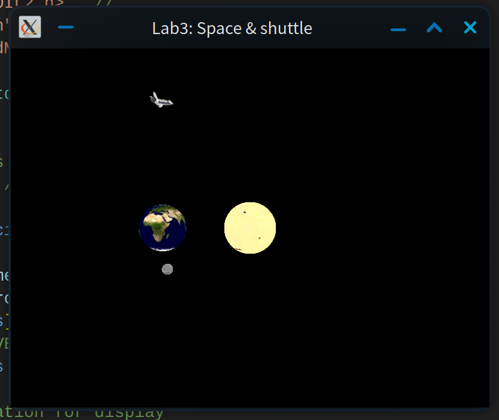

# 任务
1. 修改程序 4.4 , 使 "太阳""地球""月球" 成为带纹理的球体 (参考程序 6.1).
2. 导入 NASA 航天飞机对象, 使其也绕 "太阳" 运行 (参考程序 6.3). 对航天飞机引用适当的缩放和旋转, 使其看起来更逼真.
3. 撰写实验报告, 报告中应包含完成任务的核心代码 (注意不要大段复制粘贴代码), 运行结果的屏幕截图以及必要的讨论分析. 打包上传实验报告和原始代码, 注意代码只需要 `.h、.cpp、.glsh` 以及 3D 模型和纹理图片文件, 不要包含 VisualStudio 工程文件以及生成的临时文件.

---

# 操作步骤
## 1. 更新 VBO
将 `mian.cpp` 的 `numVBOs` 加一, 即改为 4, 以存储航天飞机的数据. 因为每个模型需要顶点位置, 纹理坐标, 法向这 3 个数据, 因此开的 `VBO` 数组的大小总数为 `numVBOs * 3`

## 2. 替换模型
### 星球
星球为球形, 参照示例程序, 使用示例程序提供的库, 将太阳, 地球和月球都改为 Sphere 类 (设置细分数为 1024)
```cpp
#define spherePrecision 1024 //

// ...

Sphere sunSphere(spherePrecision), planetSphere(spherePrecision), moonSphere(spherePrecision);
```

### 航天飞机
需要使用自定义的 `obj` 模型, 参照示例程序, 使用示例程序所提供的库, 将 "火星" 模型替换为 `ImportedModel` 类, 选择导入的航天飞机 `obj` 模型
```cpp
ImportedModel shuttle("assets/models/shuttle.obj");
```

### 纹理
因为模型新增纹理属性, 需要存储使用 `SOIL` 库加载的纹理 ID, 仿照示例程序, 使用 `GLuint` 存储纹理 ID
```cpp
GLuint sunTexture, planetTexture, moonTexture, shuttleTexture;
```

## 3. 绑定到新的 VBO
### Sphere 类
参照示例程序的 `setupSphereBuffers`, 为 Sphere 类设置 3 个 `VBO` 数据. 并做出相应调整, 可以自定义 `VBO` 的起点使得多个球体都可以共用这个函数
```cpp
bool setupSphereBuffers(Sphere &sphere, GLuint *vboBase)
{
	vector<int> ind = sphere.getIndices();
	vector<glm::vec3> vert = sphere.getVertices();
	vector<glm::vec2> tex = sphere.getTexCoords();
	vector<glm::vec3> norm = sphere.getNormals();

	vector<float> pvalues, tvalues, nvalues;
	int numIndices = sphere.getNumIndices();
	for (int i = 0; i < numIndices; i++)
	{
		pvalues.push_back(vert[ind[i]].x);
		pvalues.push_back(vert[ind[i]].y);
		pvalues.push_back(vert[ind[i]].z);
		tvalues.push_back(tex[ind[i]].x);
		tvalues.push_back(tex[ind[i]].y);
		nvalues.push_back(norm[ind[i]].x);
k		nvalues.push_back(norm[ind[i]].y);
		nvalues.push_back(norm[ind[i]].z);
	}

	glBindBuffer(GL_ARRAY_BUFFER, vboBase[0]);
	glBufferData(GL_ARRAY_BUFFER, pvalues.size() * 4, pvalues.data(), GL_STATIC_DRAW);
	glBindBuffer(GL_ARRAY_BUFFER, vboBase[1]);
	glBufferData(GL_ARRAY_BUFFER, tvalues.size() * 4, tvalues.data(), GL_STATIC_DRAW);
	glBindBuffer(GL_ARRAY_BUFFER, vboBase[2]);
	glBufferData(GL_ARRAY_BUFFER, nvalues.size() * 4, nvalues.data(), GL_STATIC_DRAW);
	return true;
}
```

在设置定点 `setupVertices` 中, Sphere 类的太阳, 地球, 月球传入相应 `VBO` 位置, 调用此函数即可
```cpp
setupSphereBuffers(sunSphere, &vbo[0 * 3]);
setupSphereBuffers(planetSphere, &vbo[1 * 3]);
setupSphereBuffers(moonSphere, &vbo[2 * 3]);
```

### 航天飞机
仿照示例程序, 使用 `ImportedModel` 类的方法, 获取顶点, 纹理和法向数据, 再将数据展为 1 维以适配 `VBO` 中的存储方式
```cpp
vector<glm::vec3> shuttleVert = shuttle.getVertices();
vector<glm::vec2> shuttleTex = shuttle.getTextureCoords();
vector<glm::vec3> shuttleNorm = shuttle.getNormals();

vector<float> pvalues, tvalues, nvalues;
for (int i = 0; i < shuttle.getNumVertices(); ++i)
{
	pvalues.push_back(shuttleVert[i].x);
	pvalues.push_back(shuttleVert[i].y);
	pvalues.push_back(shuttleVert[i].z);
	tvalues.push_back(shuttleTex[i].x);
	tvalues.push_back(shuttleTex[i].y);
	nvalues.push_back(shuttleNorm[i].x);
	nvalues.push_back(shuttleNorm[i].y);
	nvalues.push_back(shuttleNorm[i].z);
}
```

之后绑定至 `VBO`
```cpp
glBindBuffer(GL_ARRAY_BUFFER, vbo[3 * 3]);
glBufferData(GL_ARRAY_BUFFER, pvalues.size() * 4, pvalues.data(), GL_STATIC_DRAW);
glBindBuffer(GL_ARRAY_BUFFER, vbo[3 * 3 + 1]);
glBufferData(GL_ARRAY_BUFFER, tvalues.size() * 4, tvalues.data(), GL_STATIC_DRAW);
glBindBuffer(GL_ARRAY_BUFFER, vbo[3 * 3 + 2]);
glBufferData(GL_ARRAY_BUFFER, nvalues.size() * 4, nvalues.data(), GL_STATIC_DRAW);
```

## 4. 加载纹理图片
在初始化时, 仿照示例程序加载相应模型的纹理, 并将 ID 绑定到相应的变量
```cpp
sunTexture = Utils::loadTexture("assets/images/sunmap.jpg");
planetTexture = Utils::loadTexture("assets/images/earth.jpg");
moonTexture = Utils::loadTexture("assets/images/moon.jpg");
shuttleTexture = Utils::loadTexture("assets/images/spstob_1.jpg");
```

## 5. 运动变换
星球的运动可以保持不变

目标要实现航天飞机在倾斜轨道上做绕太阳的环绕运动, 且机头总是朝向运动方向, 绕自身对称轴自转

先进行测试, 不做任何运动变换 (仅缩放为了能看见), 看原始模型的摆放方式. 得到航天飞机模型的原始摆放为在原点水平放置, 机头朝屏幕里

设定航天飞机的转动平面的法向为太阳坐标系中的 $(1, 1, 1)$, 且方向与地球绕转的方向相反, 则先进行航天飞机世界坐标的旋转变换, 变为倾斜轨道. 由于地球的角动量方向在太阳坐标中为 $(0, 1, 0)$(`OpenGL` 中摄像机位置永远在原点, 看向 $z$ 的负方向, 横 $x$ 竖 $y$), 则航天飞机的角动量方向在太阳坐标中为 $(-1, -1, -1)$, 再由初始摆放位置, 则初始旋转的方向为 $(0, 1, 0) \times (-1, -1, -1)$, 对应的角度为 $\displaystyle \arccos(\frac{(0, 1, 0) \cdot (-1, -1, -1)}{|(0, 1, 0)| |(-1, -1, -1)|})$
```cpp
auto orgZ = glm::vec3(0.0f, 1.0f, 0.0f), transZ = glm::vec3(-1.0f, -1.0f, -1.0f);
mvStack.top() *= glm::rotate(glm::mat4(1.0f), acos(glm::dot(orgZ, transZ) / ((glm::length(orgZ)) * (glm::length(transZ)))), glm::cross(orgZ, transZ))
```

设定航天飞机轨道的高于地球, 为 7 个单位, 公转周期比地球长, 是地球的 $\displaystyle \frac{1}{0.85}$. 为了实现机头总是朝向运动方向, 比较简便的做法是先实现机头的对其, 进行旋转, 之后再平移出去 (此处设定为沿 $x$ 轴)
```cpp
mvStack.top() *= glm::rotate(glm::mat4(1.0f), (float)(currentTime * 0.85), orgZ);
mvStack.top() *= glm::translate(glm::mat4(1.0f), glm::vec3(7.0f, 0.0f, 0.0f));
```

之后进行机身自身的旋转, 绕其对称轴 $(0, 0, 1)$, 设定周期为公转的 $\displaystyle \frac{1}{3}$
```cpp
mvStack.top() *= glm::rotate(glm::mat4(1.0f), (float)(currentTime * 0.85 * 3), glm::vec3(0.0, 0.0, 1.0));
```

最后进行缩放, 设定其缩放为自身的 0.9 倍
```cpp
mvStack.top() *= glm::rotate(glm::mat4(1.0f), (float)(currentTime * 0.85 * 3), glm::vec3(0.0, 0.0, 1.0));
```

## 6. 渲染
### 顶点属性
#### 绑定顶点到缓冲区
由于每个模型都有 3 个 `VBO` 属性, 顶点数据偏移量为 0, 因此绑定的下标为模型序号 \* 3
```cpp
glBindBuffer(GL_ARRAY_BUFFER, vbo[i * 3]); // i 未指定
```

### 贴图属性
参照示例代码

#### 绑定贴图到缓冲区
贴图数据偏移量为 1
```cpp
glBindBuffer(GL_ARRAY_BUFFER, vbo[i * 3 + 1]); // i 未指定
```

#### 解析方式
设定顶点的属性 1, 即纹理坐标, 每个点由 2 浮点数 $(u, v)$ 组成
```cpp
glVertexAttribPointer(1, 2, GL_FLOAT, GL_FALSE, 0, 0);
```

#### 激活绑定
```cpp
glEnableVertexAttribArray(1); // 启用顶点属性 1, 允许着色器读取纹理坐标
glActiveTexture(GL_TEXTURE0); // 激活纹理单元 0, 准备绑定纹理
glBindTexture(GL_TEXTURE_2D, xxxTexture); // 将xxx的纹理绑定到当前激活的纹理单元 // xxx 未定义
```

---

# 运行结果

