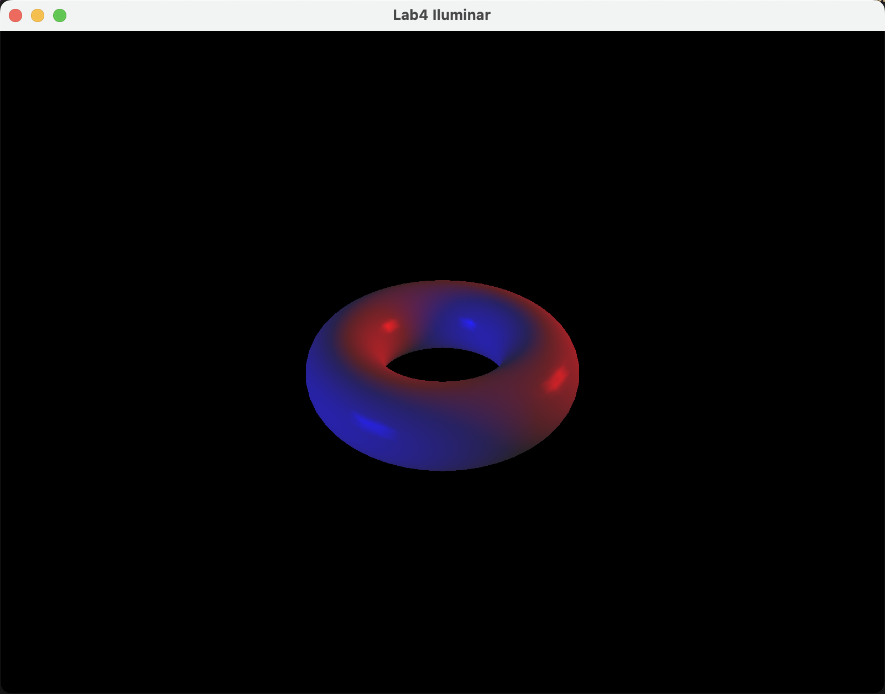
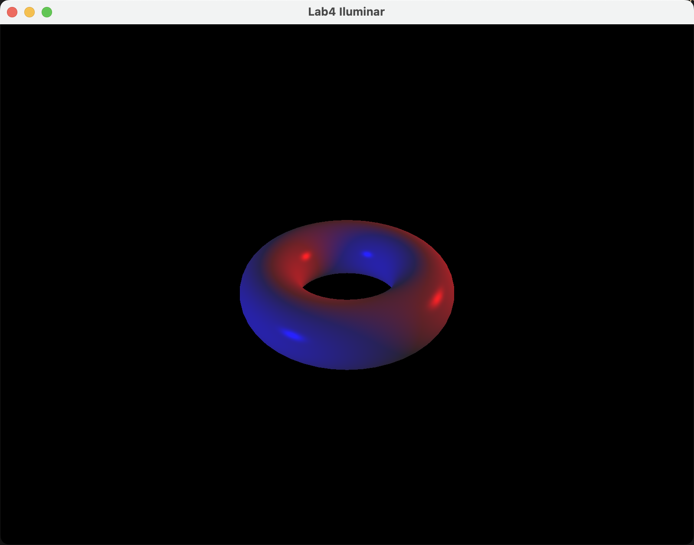
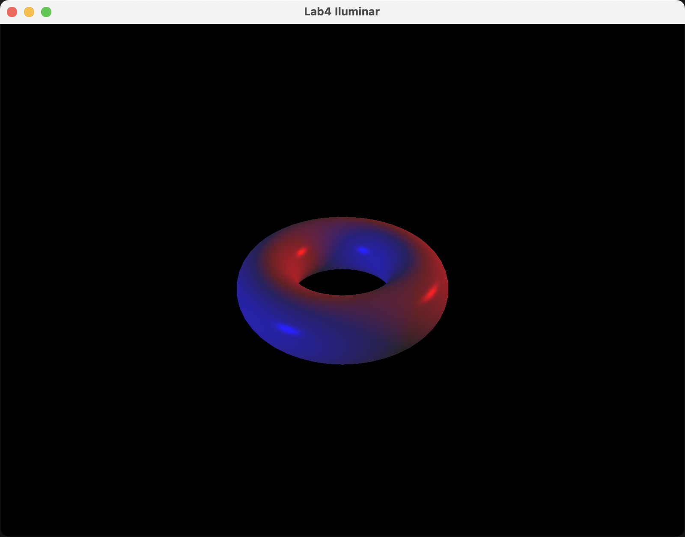

# 任务
1. 修改程序 7.2 以使其包括两个位于不同位置的位置光, 其中一个是蓝光, 另外一个是红光.
2. 片段着色器需要混合每个光的漫反射和镜面反射分量. 可以尝试简单地将它们加起来或者加权求和, 并限制结果不超出光照值的上限.
3. 撰写实验报告, 报告中应包含完成任务的核心代码 (注意不要大段复制粘贴代码), 运行结果的屏幕截图以及必要的讨论分析, 实验报告除去封面不超过5页. 打包上传实验报告和原始代码, 注意代码只需要 `.h`、`.cpp`、`.glsh` 以及 3D 模型和纹理图片文件, 不要包含 VisualStudio 工程文件以及生成的临时文件.
4. 将作业上传到 course 平台, 作业提交截止时间 4 月 22 日 23:59

---

# macOS 基本配置
## 安装基本编译构建工具
使用 `Homebrew` 作为包管理器 (已安装配置好基本编译构建工具 (`clang`, `lldb`, `cmake` 等))

## 安装 GLFW, GLEW, GLM 库
```shell
brew install glfw glew glm
```

## 安装 SOIL 库
`Homebrew` 没有直接提供 `SOIL2`, 需要下载源码手动编译
```shell
git clone https://github.com/SpartanJ/SOIL2.git
cd SOIL2
cmake -S . -B build
cd build
make
sudo make install
```

注意: 其安装路径, 安装到了 `/usr/local/`, 之后需要额外配置

## 配置 CMakeLists
`SOIL2` 在 `macOS` 中需要依赖 `CoreFoundation`, 且由于采用手动编译安装到方式, 需要明确库到路径
```cmake
find_library(COREFOUNDATION_LIBRARY CoreFoundation REQUIRED)
find_library(SOIL2_LIBRARY NAMES soil2 SOIL2 PATHS /usr/local/lib REQUIRED)
find_path(SOIL2_INCLUDE_DIRS NAMES soil2/SOIL2.h PATHS /usr/local/include REQUIRED)
```

采用更现代的方式配置头文件搜索位置
```cmake
if(UNIX)
    target_include_directories(${PROJECT_NAME} PRIVATE
        ${OPENGL_INCLUDE_DIRS}
    )
endif()

target_include_directories(${PROJECT_NAME} PRIVATE
    ${GLEW_INCLUDE_DIRS}
    ${GLFW3_INCLUDE_DIRS}
    ${GLM_INCLUDE_DIRS}
    ${SOIL2_INCLUDE_DIRS}
)
```

在连接库时, 采用更现代的方式, 不同于 `Linux`, 否则会报错: `GLFW` 库不需版本信息; 不能使用 `soil2` 的名称, 需要使用预设; 需要链接 `SOIL2` 依赖的 `CoreFoundation`
```cmake
target_link_libraries(${PROJECT_NAME}
    OpenGL::GL
    GLEW::GLEW
    glfw
)

if(APPLE)
    target_link_libraries(${PROJECT_NAME}
        ${COREFOUNDATION_LIBRARY}
        ${SOIL2_LIBRARY}
    )
else()
	target_link_libraries(${PROJECT_NAME}
        soil2
        X11
        GLX
    )
endif()
```

## 着色器配置
由于 `macOS` 仅支持最高到 4.1 的 `OpenGL` 版本, 需要把项目中相关的版本配置向下调整
`main`
```cpp
glfwWindowHint(GLFW_CONTEXT_VERSION_MAJOR, 4);
// glfwWindowHint(GLFW_CONTEXT_VERSION_MINOR, 3);
glfwWindowHint(GLFW_CONTEXT_VERSION_MINOR, 1); //
```

`*Shader`
```glsl
// #version 430
#version 410 //
```

---

# 项目配置
为了方便测试, 在每次构建都要拷贝资源 `assets` 文件夹到输出目录, 以便在修改着色器代码或资源文件时不需要清除构建文件夹. 修改之前到拷贝方式
```cmake
add_custom_target(copy_assets
    COMMAND ${CMAKE_COMMAND} -E copy_directory
    ${CMAKE_SOURCE_DIR}/assets
    ${CMAKE_BINARY_DIR}/assets
    COMMENT "Copying assets to output directory"
)

add_dependencies(${PROJECT_NAME} copy_assets)
```

为了减少冗余, 更加简洁, 将不同平台上的 `CMakeLists.txt` 合并为一个. 在不同平台有差别的地方, 使用预设变量, 进行类似以下代码中的不同平台的判断
```cmake
if(WIN32)
	...
elseif(UNIX)
	...
    if(APPLE)
	    ...
    else()
	    ...
    endif()
endif()
```

---

# 操作步骤
## 更新灯光的存储结构并重新定义灯光
采用 `vector` 来存储多个灯光. 每个灯光分别有环境, 漫反射, 镜面反射还有初始位置这 4 个属性, 用结构体来捆绑属性

由于在 `Shader` 中需要使用 `varying` 变量传入所有灯光的全部属性, 会占用空间, 但是这个空间是有限的, 上限为 128 个, 加之还有其他的变量也会占用空间, 因此, 灯光的数量会有上限, 经过测试, 在所有平台都安全的为 2 的幂次的上限是 8. 为了防止灯光数超限, 取灯光数为定义的数量和上限的最小值

存储当前灯光经过运动后的位置的变量也需要做出相应的调整, 使用 `vector` 来对多灯光进行支持. 将 `currentLightPos` 的个数加一, 最后一个用来当计算不同灯光的中间临时变量

根据要求, 定义 2 个光源. 第一个光源为蓝光, 初始位置同示例代码位置. 第二个为红光, 初始位置与蓝光关于原点对称. 由于光色为 3 元色的纯光, 只有一个分量有值, 光强度比白光小, 需要增加相应分量的强度

去除更新后原先多余的全局变量
```cpp
#include <vector>						//

// ...

// glm::vec3 initialLightLoc = glm::vec3(5.0f, 2.0f, 2.0f);
/*
 */
struct Light
{
	glm::vec4 ambient;
	glm::vec4 diffuse;
	glm::vec4 specular;
	glm::vec3 initialPosition;
};
vector<Light> lights = {{glm::vec4(0.0f, 0.0f, 0.1f, 1.0f), glm::vec4(0.0f, 0.0f, 2.0f, 1.0f), glm::vec4(0.0f, 0.0f, 2.0f, 1.0f), glm::vec3(5.0f, 2.0f, 2.0f)}, {glm::vec4(0.1f, 0.0f, 0.0f, 1.0f), glm::vec4(2.0f, 0.0f, 0.0f, 1.0f), glm::vec4(2.0f, 0.0f, 0.0f, 1.0f), glm::vec3(-5.0f, -2.0f, -2.0f)}};
int numActiveLights = min((int)lights.size(), MAX_LIGHTS);

// ...

// GLuint globalAmbLoc, ambLoc, diffLoc, specLoc, posLoc, mambLoc, mdiffLoc, mspecLoc, mshiLoc;
GLuint globalAmbLoc, numLightsLoc, mambLoc, mdiffLoc, mspecLoc, mshiLoc; //

// ...

// glm::vec3 currentLightPos, transformed;
// float lightPos[3];
vector<glm::vec3> currentLightPos(numActiveLights + 1); //
vector<float> lightPos(3 * numActiveLights);			//

// ...

// float lightAmbient[4] = {0.0f, 0.0f, 0.0f, 1.0f};
// float lightDiffuse[4] = {1.0f, 1.0f, 1.0f, 1.0f};
// float lightSpecular[4] = {1.0f, 1.0f, 1.0f, 1.0f};
```

## 更新着色器
定义最大灯光数, 在 2 个 `Shader` 中和 `mian` 中保持一致, 避免错误. 改单一灯光变量为灯光数组, 以支持多灯光, 同时, 增加接收灯光的个数
```glsl
#define MAX_LIGHTS 8 //

// ...

// uniform PositionalLight light;
uniform int numLights;					   //
uniform PositionalLight light[MAX_LIGHTS]; //
```

在计算 ADS 时, 初始化 A 为总体环境光的贡献, 其他为 0. 循环遍历所有灯光, 将入射光的计算和反射光 (包含中指向量) 的计算移入遍历循环中, 把计算出不同灯光的贡献加起来. 最后 D 和 S 再除以灯光总数做平均, 并设定分量亮度的最大值为 1, 超过则截取

### Gouraud
#### 顶点着色器
```glsl
// // calculate view-space light vector (from point to light)
// vec3 L = normalize(light.position - P.xyz);

// ...

// //  R is reflection of -L around the plane defined by N
// vec3 R = reflect(-L, N);

// ambient, diffuse, and specular contributions
// vec3 ambient =
// 	((globalAmbient * material.ambient) + (light.ambient * material.ambient)).xyz;

// vec3 diffuse =
// 	light.diffuse.xyz * material.diffuse.xyz * max(dot(N, L), 0.0);

// vec3 specular =
// 	pow(max(dot(R, V), 0.0f), material.shininess) * material.specular.xyz * light.specular.xyz;
vec3 ambient = (material.ambient * globalAmbient).xyz, diffuse = vec3(0.0), specular = vec3(0.0); //

/*
 */
for (int i = 0; (i < MAX_LIGHTS) && (i < numLights); ++i)
{
	vec3 L = normalize(light[i].position - P.xyz), R = reflect(-L, N);

	ambient += (material.ambient * light[i].ambient).xyz, diffuse += material.diffuse.xyz * light[i].diffuse.xyz * max(dot(N, L), 0.0), specular += material.specular.xyz * light[i].specular.xyz * pow(max(dot(R, V), 0.0f), material.shininess);
}
if (numLights > 0)
	diffuse /= float(numLights), specular /= float(numLights);

// send the color output to the fragment shader
varyingColor = vec4((ambient + diffuse + specular), 1.0);
```

### Phong
更改 `varyingLightDir` 为数组, 以支持多灯光

#### 顶点着色器
```glsl
// out vec3 varyingLightDir;
out vec3 varyingLightDir[MAX_LIGHTS]; //

// ...

// varyingLightDir = light.position - varyingVertPos;

// ...

/*
 */
for (int i = 0; (i < MAX_LIGHTS) && (i < numLights); ++i)
	varyingLightDir[i] = light[i].position - varyingVertPos;
```

#### 片段着色器
```glsl
// in vec3 varyingLightDir;
in vec3 varyingLightDir[MAX_LIGHTS]; //

// ...

// vec3 L = normalize(varyingLightDir);

// ...

// // compute light reflection vector, with respect N:
// vec3 R = normalize(reflect(-L, N));

// // get the angle between the light and surface normal:
// float cosTheta = dot(L, N);

// // angle between the view vector and reflected light:
// float cosPhi = dot(V, R);

// compute ADS contributions (per pixel):
// vec3 ambient = ((globalAmbient * material.ambient) + (light.ambient * material.ambient)).xyz;
// vec3 diffuse = light.diffuse.xyz * material.diffuse.xyz * max(cosTheta, 0.0);
// vec3 specular = light.specular.xyz * material.specular.xyz * pow(max(cosPhi, 0.0), material.shininess);
vec3 ambient = (material.ambient * globalAmbient).xyz, diffuse = vec3(0.0), specular = vec3(0.0); //

/*
 */
for (int i = 0; (i < MAX_LIGHTS) && (i < numLights); ++i)
{
	vec3 L = normalize(varyingLightDir[i]), R = reflect(-L, N);

	float cosTheta = dot(N, L), cosPhi = dot(R, V);

	ambient += (material.ambient * light[i].ambient).xyz, diffuse += material.diffuse.xyz * light[i].diffuse.xyz * max(cosTheta, 0.0), specular += material.specular.xyz * light[i].specular.xyz * pow(max(cosPhi, 0.0), material.shininess);
}
if (numLights > 0)
	diffuse /= float(numLights), specular /= float(numLights);

fragColor = vec4((ambient + diffuse + specular), 1.0);
```

### BlinnPhong
相比 Phong 着色器还需修改 `varyingHalfVector` 为数组, 以支持多灯光

#### 顶点着色器
```glsl
// out vec3 varyingHalfVector;
out vec3 varyingHalfVector[MAX_LIGHTS]; //
```

#### 片段着色器
```glsl
// in vec3 varyingHalfVector;
in vec3 varyingHalfVector[MAX_LIGHTS]; //

// ...

// vec3 L = normalize(varyingLightDir);

// ...

// // get the angle between the light and surface normal:
// float cosTheta = dot(L, N);

// // halfway vector varyingHalfVector was computed in the vertex shader,
// // and interpolated prior to reaching the fragment shader.
// // It is copied into variable H here for convenience later.
// vec3 H = normalize(varyingHalfVector);

// // get angle between the normal and the halfway vector
// float cosPhi = dot(H, N);

// // compute ADS contributions (per pixel):
// vec3 ambient = ((globalAmbient * material.ambient) + (light.ambient * material.ambient)).xyz;
// vec3 diffuse = light.diffuse.xyz * material.diffuse.xyz * max(cosTheta, 0.0);
// vec3 specular = light.specular.xyz * material.specular.xyz * pow(max(cosPhi, 0.0), material.shininess * 3.0);
vec3 ambient = (material.ambient * globalAmbient).xyz, diffuse = vec3(0.0), specular = vec3(0.0); //

/*
 */
for (int i = 0; (i < MAX_LIGHTS) && (i < numLights); i++)
{
	vec3 L = normalize(varyingLightDir[i]), H = normalize(varyingHalfVector[i]);

	float cosTheta = dot(L, N), cosPhi = dot(H, N);

	ambient += (material.ambient * light[i].ambient).xyz, diffuse += material.diffuse.xyz * light[i].diffuse.xyz * max(cosTheta, 0.0), specular += material.specular.xyz * light[i].specular.xyz * pow(max(cosPhi, 0.0), material.shininess * 3.0);
}
if (numLights > 0)
	diffuse /= float(numLights), specular /= float(numLights);

fragColor = vec4((ambient + diffuse + specular), 1.0);
```

## 更改材质属性
为了能跟清楚的反应灯光效果, 改材质为预定的银质
```cpp
// // gold material
// float *matAmb = Utils::goldAmbient();
// float *matDif = Utils::goldDiffuse();
// float *matSpe = Utils::goldSpecular();
// float matShi = Utils::goldShininess();
float *matAmb = Utils::silverAmbient();
float *matDif = Utils::silverDiffuse();
float *matSpe = Utils::silverSpecular();
float matShi = Utils::silverShininess();
```

## 更新设定灯光函数
在 `installLights` 中

### 位置变换
遍历所有灯光, 更新变换后的存储数组
```cpp
// transformed = glm::vec3(vMatrix * glm::vec4(currentLightPos, 1.0));
// lightPos[0] = transformed.x;
// lightPos[1] = transformed.y;
// lightPos[2] = transformed.z;
/*
 */
for (int i = 0; i < numActiveLights; ++i)
	currentLightPos.back() = glm::vec3(vMatrix * glm::vec4(currentLightPos[i], 1.0f)), lightPos[i * 3] = (currentLightPos.back()).x, lightPos[i * 3 + 1] = (currentLightPos.back()).y, lightPos[i * 3 + 2] = (currentLightPos.back()).z;
```

### 设置灯光属性
增加灯光个数的设定. 对于每个灯光的属性, 需要遍历所有灯光, 设定移至循环内
```glsl
numLightsLoc = glGetUniformLocation(renderingProgram, "numLights"); //
// ...
// ambLoc = glGetUniformLocation(renderingProgram, "light.ambient");
// diffLoc = glGetUniformLocation(renderingProgram, "light.diffuse");
// specLoc = glGetUniformLocation(renderingProgram, "light.specular");
// posLoc = glGetUniformLocation(renderingProgram, "light.position")

// ...

glProgramUniform1i(renderingProgram, numLightsLoc, numActiveLights); //
// ...
// glProgramUniform4fv(renderingProgram, ambLoc, 1, lightAmbient);
// glProgramUniform4fv(renderingProgram, diffLoc, 1, lightDiffuse);
// glProgramUniform4fv(renderingProgram, specLoc, 1, lightSpecular);
// glProgramUniform3fv(renderingProgram, posLoc, 1, lightPos);

// ...

/*
 */
for (int i = 0; i < numActiveLights; ++i)
{
	string lightBaseStr = "light[" + to_string(i) + "]";
	GLuint ambLoc = glGetUniformLocation(renderingProgram, (lightBaseStr + ".ambient").c_str());
	GLuint diffLoc = glGetUniformLocation(renderingProgram, (lightBaseStr + ".diffuse").c_str());
	GLuint specLoc = glGetUniformLocation(renderingProgram, (lightBaseStr + ".specular").c_str());
	GLuint posLoc = glGetUniformLocation(renderingProgram, (lightBaseStr + ".position").c_str());

	glProgramUniform4fv(renderingProgram, ambLoc, 1, glm::value_ptr(lights[i].ambient));
	glProgramUniform4fv(renderingProgram, diffLoc, 1, glm::value_ptr(lights[i].diffuse));
	glProgramUniform4fv(renderingProgram, specLoc, 1, glm::value_ptr(lights[i].specular));
	glProgramUniform3fv(renderingProgram, posLoc, 1, &lightPos[i * 3]);
}
```

## 更新灯光运动
在 `display` 中, 遍历所有灯光, 设定偶数下标灯光正转, 奇数反向, 记录到存储的数组中. 速度同示例代码的
```cpp
// currentLightPos = glm::vec3(initialLightLoc.x, initialLightLoc.y, initialLightLoc.z);
// amt = currentTime * 25.0f;
// rMat = glm::rotate(glm::mat4(1.0f), toRadians(amt), glm::vec3(0.0f, 0.0f, 1.0f));
// currentLightPos = glm::vec3(rMat * glm::vec4(currentLightPos, 1.0f));
/*
 */
for (int i = 0; i < numActiveLights; ++i)
{
	auto rotationSpeed = ((i % 2) ? -1.0f : 1.0f) * 25.0f;
	amt = currentTime * rotationSpeed, rMat = glm::rotate(glm::mat4(1.0f), toRadians(amt), glm::vec3(0.0f, 0.0f, 1.0f)), currentLightPos[i] = glm::vec3(rMat * glm::vec4(lights[i].initialPosition, 1.0f));
}
```

---

# 运行结果
## Gouraud


## Phong


## BlinnPhong

