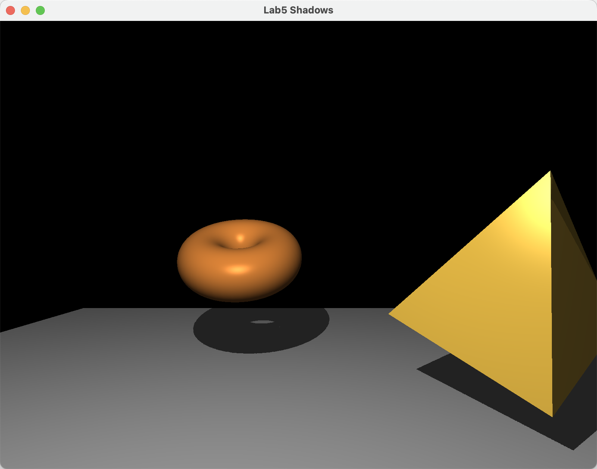

# 任务
_**随堂作业 (不需要提交)**_
- 修改程序 8.1, 向场景添加地平面, 并添加动画, 使得对象或光源 (或两者一起) 自行移动, 例如一个绕另一个旋转.

---

# macOS 新增代码调整
由于 `macOS` 下 `OpenGL` 最高版本只支持到 4.10, 此版本还不支持 `layout(binding = 0) uniform sampler2DShadow shadowTex;` 中的 `layout(binding = N)` 布局限定符语法, 其显示的指定 `uniform` 变量的绑定点, 需要去除. 由于 `OpenGL` 规范要求, 采样器的默认绑定单元是 0, 符合要求, 无需要再调用 `glGetUniformLocation` 和 `glUniform1i` 来设置纹理单元.

---

# 操作步骤
为了使观看方便, 在 `main` 中将窗口改为 $800 \times 600$ 横屏
```cpp
// GLFWwindow *window = glfwCreateWindow(800, 800, "Chapter8 - program1", NULL, NULL);
GLFWwindow *window = glfwCreateWindow(800, 600, "Lab5 Shadows", NULL, NULL); //
```

## 添加地平面
### 变量更新
加入的地平面使用给定的银的材质, 为了方便起见, 不使用索引的方式而直接指定, 因此 `VBO` 需要增加地面的顶点和法向 2 组数据. 地面位置需要向下平移. 由于使用银材质没有加载, 需要从 `Utils` 中加载
```cpp
// #define numVBOs 5
#define numVBOs 7 //

//...

int numGroundVertices; //

//...

glm::vec3 groundLoc(0.0f, -2.0f, 0.0f); //

//...

/*
 */
float *sMatAmb = Utils::silverAmbient();
float *sMatDif = Utils::silverDiffuse();
float *sMatSpe = Utils::silverSpecular();
float sMatShi = Utils::silverShininess();
```

### 设置顶点
在 `setupVertices` 中, 地平面为正方形, 中心在原点, 变长 15, 沿对角线分为 2 个三角形. 顶点和法向分别绑定在最后 2 个 `VBO` 中
```cpp
/*
 */
numGroundVertices = 6;
float groundVertices[6 * 3] = {-7.5f, 0.0f, -7.5f, -7.5f, 0.0f, 7.5f, 7.5f, 0.0f, -7.5f, 7.5f, 0.0f, 7.5f, 7.5f, 0.0f, -7.5f, -7.5f, 0.0f, 7.5f};
float groundNormals[6 * 3] = {0.0f, 1.0f, 0.0f, 0.0f, 1.0f, 0.0f, 0.0f, 1.0f, 0.0f, 0.0f, 1.0f, 0.0f, 0.0f, 1.0f, 0.0f, 0.0f, 1.0f, 0.0f};
std::vector<float> groundPvalues(groundVertices, groundVertices + sizeof(groundVertices) / sizeof(float));
std::vector<float> groundNvalues(groundNormals, groundNormals + sizeof(groundNormals) / sizeof(float));

//...

/*
 */
glBindBuffer(GL_ARRAY_BUFFER, vbo[5]);
glBufferData(GL_ARRAY_BUFFER, groundPvalues.size() * 4, &groundPvalues[0], GL_STATIC_DRAW);
glBindBuffer(GL_ARRAY_BUFFER, vbo[6]);
glBufferData(GL_ARRAY_BUFFER, groundNvalues.size() * 4, &groundNvalues[0], GL_STATIC_DRAW);
```

### 设置渲染
#### 第一轮
构建地面模型矩阵, 之后计算在光源视角下的 `MVP` 矩阵, 并发送给第一轮的着色器, 绑定 `VBO` 并设置相关属性, 最后绘制
```cpp
/*
 */
mMat = glm::translate(glm::mat4(1.0f), groundLoc);
shadowMVP1 = lightPmatrix * lightVmatrix * mMat;
glUniformMatrix4fv(sLoc, 1, GL_FALSE, glm::value_ptr(shadowMVP1));
glBindBuffer(GL_ARRAY_BUFFER, vbo[2 * 3 - 1]);
glVertexAttribPointer(0, 3, GL_FLOAT, GL_FALSE, 0, 0);
glEnableVertexAttribArray(0);
glDrawArrays(GL_TRIANGLES, 0, numGroundVertices);
```

#### 第二轮
在 `passTwo` 中, 首先设置当前渲染的地平面的材质为导入的银质和模型矩阵, 并将灯光和材质发送至着色器
```cpp
/*
 */
thisAmb[0] = sMatAmb[0], thisAmb[1] = sMatAmb[1], thisAmb[2] = sMatAmb[2];
thisDif[0] = sMatDif[0], thisDif[1] = sMatDif[1], thisDif[2] = sMatDif[2];
thisSpe[0] = sMatSpe[0], thisSpe[1] = sMatSpe[1], thisSpe[2] = sMatSpe[2];
thisShi = sMatShi;
mMat = glm::translate(glm::mat4(1.0f), groundLoc);
installLights(renderingProgram2, vMat);
```

再计算变换矩阵, `MV` 矩阵和其逆转置, 以及从模型空间到阴影纹理的转换矩阵
```cpp
mvMat = vMat * mMat;
invTrMat = glm::transpose(glm::inverse(mvMat));
shadowMVP2 = b * lightPmatrix * lightVmatrix * mMat;
```

再将统一变量发送至着色器
```cpp
glUniformMatrix4fv(mvLoc, 1, GL_FALSE, glm::value_ptr(mvMat));
glUniformMatrix4fv(projLoc, 1, GL_FALSE, glm::value_ptr(pMat));
glUniformMatrix4fv(nLoc, 1, GL_FALSE, glm::value_ptr(invTrMat));
glUniformMatrix4fv(sLoc, 1, GL_FALSE, glm::value_ptr(shadowMVP2));
```

最后绑定顶点和法向的 `VBO` 并设置属性后绘制
```cpp
glBindBuffer(GL_ARRAY_BUFFER, vbo[2 * 3 - 1]);
glVertexAttribPointer(0, 3, GL_FLOAT, GL_FALSE, 0, 0);
glEnableVertexAttribArray(0);
glBindBuffer(GL_ARRAY_BUFFER, vbo[2 * 3]);
glVertexAttribPointer(1, 3, GL_FLOAT, GL_FALSE, 0, 0);
glEnableVertexAttribArray(1);
glDrawArrays(GL_TRIANGLES, 0, numGroundVertices);
```

## 实现物体运动
在 `display` 中, 让灯光, 圆环和金字塔的平行于地平面绕法向旋转. 分别设置它们的旋转半径和速度, 并计算当前转角, 再更新位置
```cpp
/*
 */
float lightRotateRadius = 5.0f, lightRotateSpeed = 0.5f, lightAngle = currentTime * lightRotateSpeed;
lightLoc.x = lightRotateRadius * cos(lightAngle), lightLoc.z = lightRotateRadius * sin(lightAngle);
float torusRotateRadius = 1.0f, torusRotateSpeed = 1.0f, torusAngle = currentTime * torusRotateSpeed;
torusLoc.x = torusRotateRadius * cos(torusAngle), torusLoc.z = torusRotateRadius * sin(torusAngle);
float pyrRotateRadius = 3.0f, pyrRotateSpeed = -0.75f, pyrAngle = currentTime * pyrRotateSpeed;
pyrLoc.x = pyrRotateRadius * cos(pyrAngle), pyrLoc.z = pyrRotateRadius * sin(pyrAngle);
```

---

# 运行结果

