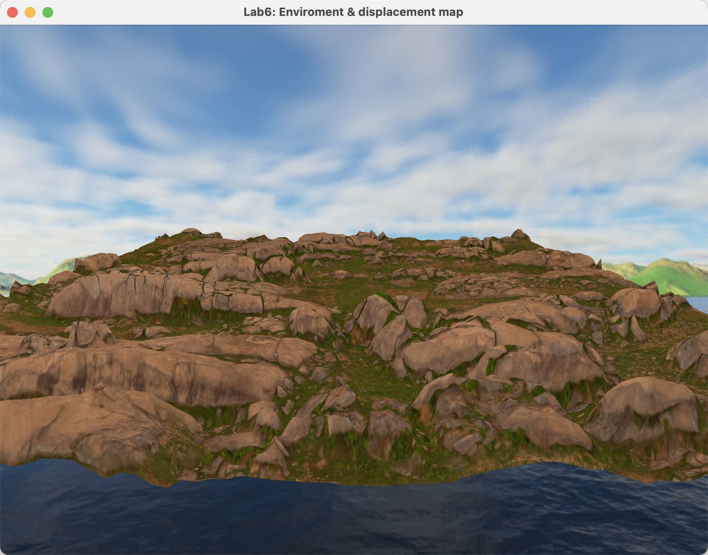

# 任务
1. 使用任意画图软件生成一份地形高度图, 并在程序 10.4 中使用它.
2. 为地形模型贴上合适的纹理贴图.
3. 利用天空盒为场景添加背景.
4. 撰写实验报告, 报告中应包含完成任务的核心代码 (注意不要大段复制粘贴代码), 运行结果的屏幕截图以及必要的讨论分析. 打包上传实验报告和原始代码, 注意代码只需要 `.h`、`.cpp`、`.glsh` 以及 3D 模型和图片文件, 不要包含 `VisualStudio` 工程文件以及 生成的临时文件.
5. 将作业上传到 course 平台, 作业提交截止时间 5 月 20 日 23:59

---

# 操作步骤
## 替换地平面的贴图
查找合适的 [贴图资源](https://polyhaven.com/a/rocky_terrain) 并下载纹理 (Diffuse) 和高度 (Displacement) 贴图. 在 `main` 中的 `init` 函数里进行替换
```cpp
// heightTexture = Utils::loadTexture("heightTexture.jpg");
// heightMap = Utils::loadTexture("height.jpg");
// heightTexture = Utils::loadTexture("assets/images/heightTexture.jpg"); //
// heightMap = Utils::loadTexture("assets/images/height.jpg");			   //
```

但是运行发现只有纹理贴图有效果, 高度贴图并没有使平面起伏, 并且有错误输出 `UNSUPPORTED (log once): POSSIBLE ISSUE: unit 0 GLD_TEXTURE_INDEX_2D is unloadable and bound to sampler type (Float) - using zero texture because texture unloadable`. 将下载的高度贴图和成功运行的示例贴图分别导入 `PS` 中, 发现下载的是灰度 (Grayscale) 图而示例是 `RGB` 彩图, 应该是程序解析的高度图是 `RGB` 图而不能正确处理灰度图导致的. 将其转换为 `RGB` 图再重新替换使用, 能正确得到效果, 无报错.
```cpp
heightTexture = Utils::loadTexture("assets/images/rocky_terrain_diff_2k.png"); //
heightMap = Utils::loadTexture("assets/images/rocky_terrain_disp_2k_rgb.png"); //
```

## 添加天空盒为场景背景
### 添加着色器
复制示例程序的天空盒着色器, 并做相应修改以适配 4.10 的 `OpenGL` 版本
#### 顶点
```glsl
//vertCShader.glsl
// #version 430
#version 410 //

//...

// layout(binding = 0) uniform samplerCube samp;
uniform samplerCube samp; //

//...

```

#### 片段
```glsl
//fragCShader.glsl
// #version 430
#version 410 //

//...

// layout(binding = 0) uniform samplerCube samp;
uniform samplerCube samp; //

//...

```

### 添加 (修改) 相关变量
天空盒可以和地平面使用同一个 `VAO`, 但是需要添加一个 `VBO`. 渲染程序也需要添加一个对应渲染天空盒的. 由于天空盒着色器需要一个视图矩阵作为输入, 因此还需添加一个统一变量还记录. 最后天空盒的贴图还需要一个变量
```cpp
// #define numVBOs 3
#define numVBOs 4 //

//...

// GLuint renderingProgram;
GLuint renderingProgram, renderingProgramCubeMap; //

//...

// GLuint mvLoc, projLoc;
GLuint mvLoc, projLoc, vLoc; //

//...

GLuint skyboxTexture; //
```

### 设置顶点数据
在 `setupVertices` 中, 参考示例程序, 先定义天空盒的顶点位置. 在绑定 `VAO` 后, 进行 `VBO` 和数据的绑定
```cpp
/*
 */
float cubeVertexPositions[108] =
	{-1.0f, 1.0f, -1.0f, -1.0f, -1.0f, -1.0f, 1.0f, -1.0f, -1.0f,
	 1.0f, -1.0f, -1.0f, 1.0f, 1.0f, -1.0f, -1.0f, 1.0f, -1.0f,
	 1.0f, -1.0f, -1.0f, 1.0f, -1.0f, 1.0f, 1.0f, 1.0f, -1.0f,
	 1.0f, -1.0f, 1.0f, 1.0f, 1.0f, 1.0f, 1.0f, 1.0f, -1.0f,
	 1.0f, -1.0f, 1.0f, -1.0f, -1.0f, 1.0f, 1.0f, 1.0f, 1.0f,
	 -1.0f, -1.0f, 1.0f, -1.0f, 1.0f, 1.0f, 1.0f, 1.0f, 1.0f,
	 -1.0f, -1.0f, 1.0f, -1.0f, -1.0f, -1.0f, -1.0f, 1.0f, 1.0f,
	 -1.0f, -1.0f, -1.0f, -1.0f, 1.0f, -1.0f, -1.0f, 1.0f, 1.0f,
	 -1.0f, -1.0f, 1.0f, 1.0f, -1.0f, 1.0f, 1.0f, -1.0f, -1.0f,
	 1.0f, -1.0f, -1.0f, -1.0f, -1.0f, -1.0f, -1.0f, -1.0f, 1.0f,
	 -1.0f, 1.0f, -1.0f, 1.0f, 1.0f, -1.0f, 1.0f, 1.0f, 1.0f,
	 1.0f, 1.0f, 1.0f, -1.0f, 1.0f, 1.0f, -1.0f, 1.0f, -1.0f};

//...

/*
 */
glBindBuffer(GL_ARRAY_BUFFER, vbo[3]);
glBufferData(GL_ARRAY_BUFFER, sizeof(cubeVertexPositions), cubeVertexPositions, GL_STATIC_DRAW);
```

### 修改初始化函数
在 `init` 中, 添加创建天空盒渲染程序, 再加载贴图
```cpp
renderingProgramCubeMap = Utils::createShaderProgram("assets/shaders/vertCShader.glsl", "assets/shaders/fragCShader.glsl"); //

//...

skyboxTexture = Utils::loadCubeMap("assets/images/cubeMap");				   //
```

### 修改显示函数
在 `display` 中, 参考示例程序, 需要先进行天空盒的渲染再进行场景中其他的渲染. 但是进行天空盒的渲染需要使用视图矩阵和投影矩阵, 因此将这些矩阵的计算提前
```cpp
/*
 */
vMat = glm::translate(glm::mat4(1.0f), glm::vec3(-cameraX, -cameraY, -cameraZ));
mMat = glm::translate(glm::mat4(1.0f), glm::vec3(gndLocX, gndLocY, gndLocZ));
mMat = glm::rotate(mMat, toRadians(15.0f), glm::vec3(1.0f, 0.0f, 0.0f));
mvMat = vMat * mMat;

/*
 */
glUseProgram(renderingProgramCubeMap);
vLoc = glGetUniformLocation(renderingProgramCubeMap, "v_matrix");
glUniformMatrix4fv(vLoc, 1, GL_FALSE, glm::value_ptr(vMat));
projLoc = glGetUniformLocation(renderingProgramCubeMap, "proj_matrix");
glUniformMatrix4fv(projLoc, 1, GL_FALSE, glm::value_ptr(pMat));
// glBindBuffer(GL_ARRAY_BUFFER, vbo[0]);
glBindBuffer(GL_ARRAY_BUFFER, vbo[3]); //
glVertexAttribPointer(0, 3, GL_FLOAT, GL_FALSE, 0, 0);
glEnableVertexAttribArray(0);
glActiveTexture(GL_TEXTURE0);
glBindTexture(GL_TEXTURE_CUBE_MAP, skyboxTexture);
glUniform1i(glGetUniformLocation(renderingProgramCubeMap, "samp"), 0); //
glEnable(GL_CULL_FACE);
glFrontFace(GL_CCW); // cube is CW, but we are viewing the inside
glDisable(GL_DEPTH_TEST);
glDrawArrays(GL_TRIANGLES, 0, 36);
glEnable(GL_DEPTH_TEST);

//...

// vMat = glm::translate(glm::mat4(1.0f), glm::vec3(-cameraX, -cameraY, -cameraZ));
// mMat = glm::translate(glm::mat4(1.0f), glm::vec3(gndLocX, gndLocY, gndLocZ));
// mMat = glm::rotate(mMat, toRadians(15.0f), glm::vec3(1.0f, 0.0f, 0.0f));
// mvMat = vMat * mMat;
```

---

# 运行结果

