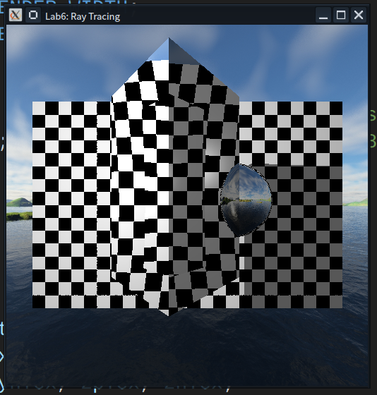

# 任务
1. 对程序 16.10 进行更改: 移动立方体, 使其位于球体的前面;
2. 使立方体透明、折射, 并使球体反射;
3. 移动棋盘格平面, 以便它垂直地放置于立方体和球体的后面;
4. 移动物体, 以便通过透明立方体可以看到球体和棋盘格平面;
5. 撰写实验报告, 报告中应包含完成任务的核心代码 (注意不要大段复制粘贴代码), 运行结果的屏幕截图以及必要的讨论分析. 打包上传实验报告和原始代码, 注意代码只需要 `.h`、`.cpp`、`.glsh` 以及 `3D` 模型和图片文件, 不要包含 `VisualStudio` 工程文件以及 生成的临时文件.
6. 将作业上传到 course 平台, 作业提交截止时间 6 月 8 日 23:59

---

# 操作步骤
## 适配调整
### 平台调整
由于 `macOS` 下 `OpenGL` 最高版本只支持到 4.10, 此版本还不支持计算着色器, 需要最低 4.30 才行. 适配 `macOS` 有些麻烦, 因此放弃, 选择在 `Linux` 上运行.

### 片段着色器的兼容
示例代码使用的 `gl_FragColor` 是已过时的语法, 运行报错
```shell
Shader Info Log: 0:10(2): error: `gl_FragColor' undeclared
0:10(22): error: no function with name 'texture2D'
0:10(22): error: type mismatch
0:10(17): error: cannot construct `vec4' from a non-numeric data type

linking failed
Program Info Log: error: linking with uncompiled/unspecialized shader
```

更新为现代的 4.30 语法
```glsl
#version 430

layout(binding = 0) uniform sampler2D tex;

in vec2 uv;
out vec4 fragColor; //

void main()
{
	// gl_FragColor = vec4(texture2D(tex, uv).rgb, 1.0);
	fragColor = vec4(texture(tex, uv).rgb, 1.0); //
}

```

### 图片加载兼容
示例代码运行显示的是全粉色的, 没有正确使用着色器. 原因是在 `mian` 中, `glTexImage2D(GL_TEXTURE_2D, 0, GL_RGBA, RAYTRACE_RENDER_WIDTH, RAYTRACE_RENDER_HEIGHT, 0, GL_RGBA, GL_UNSIGNED_BYTE, (const void *)screenTexture);` 加载贴图, 没有明确图片位数, 使用了默认的 (可能不是 8 位的). 但是在计算着色器 `raytraceComputeShader.glsl` 中, `layout(binding = 0, rgba8) uniform image2D output_texture;`, 明确需要 8 位的, 导致了不兼容. 因此, 修改 `main`, 明确加载图片的位数为 8 位, `	glTexImage2D(GL_TEXTURE_2D, 0, GL_RGBA8, RAYTRACE_RENDER_WIDTH, RAYTRACE_RENDER_HEIGHT, 0, GL_RGBA, GL_UNSIGNED_BYTE, (const void *)screenTexture); //`

## 移动元素位置
为了使立方体靠前, 遮挡住球体, 需要将立方体的位置 `box_pos` 沿 z 轴正方向移动适当距离, 球体的位置 `sphere_position` 沿 z 负方向移动. 且为了使球体和立方体有更好的遮挡效果, 需要向右移动球体. 将平面从水平的底部竖起来后, 不需要再把平面向下平移 (即 y 轴负方向), 放在正中心即可
```glsl
// vec3 sphere_position = vec3(0.5, 0.1, 3.2);
vec3 sphere_position = vec3(1.0, 0.1, 1.0); //
vec3 sphere_color = vec3(1.0, 0.0, 0.0);	// red

//...

// vec3 box_pos = vec3(-0.2, 0.3, 0.5);
vec3 box_pos = vec3(-0.2, 0.3, 2.0); //

//...

// vec3 plane_pos = vec3(0, -2.5, -2.0); // 0,-1.2,-2
vec3 plane_pos = vec3(0, 0, -2.0); // 0,-1.2,-2 //
```

## 重写平面碰撞
将平面从水平变为竖直, 整体方向变了, 需要重写平面碰撞, 将原先的 y 轴法向变为 z 轴法向, z 轴贴图方向变为 y 轴贴图方向
```glsl
// c.t = dot((vec3(0, 0, 0) - ray_start), vec3(0, 1, 0)) / dot(ray_dir, vec3(0, 1, 0));
c.t = dot((vec3(0, 0, 0) - ray_start), vec3(0, 0, 1)) / dot(ray_dir, vec3(0, 0, 1)); //

//...

// if ((abs(intersectPoint.x) > (plane_width / 2.0)) || (abs(intersectPoint.z) > (plane_depth / 2.0)))
if ((abs(intersectPoint.x) > (plane_width / 2.0)) || (abs(intersectPoint.y) > (plane_depth / 2.0))) //

//...

// c.n = vec3(0.0, 1.0, 0.0);
c.n = vec3(0.0, 0.0, 1.0); //

//...

// if (ray_dir.y > 0.0)
if (ray_dir.z > 0.0) //

//...

// (c.tc).y = (intersectPoint.z + plane_depth / 2.0) / maxDimension;
(c.tc).y = (intersectPoint.y + plane_depth / 2.0) / maxDimension; //
```

## 更改二级光线追踪
示例中递归层数为 3, 第 3 级光线为终止递归的处理, 无反射折射下一级效果, 无需做更改. 但从第 2 级光线需要对相应物体的反射折射性做出改变.

### 球体
球体从折射改为反射, 减弱舍入误差的影响的反射光起点偏移也应做相应调整, 从向法向内偏移改为向外
```glsl
// refracted_ray.start = c.p - c.n * 0.001;
// refracted_ray.dir = refract(r.dir, c.n, 1.5);
refracted_ray.start = c.p + c.n * 0.001; //
refracted_ray.dir = reflect(r.dir, c.n); //
```

### 立方体
需要从原先无透射效果改为有. 首先根据示例代码中球体的折射属性, 定义立方体的折射率为 1.5 (光线从外和从内的比折射率 `eta` 不同, 互为倒数, 从空气射入立方体为折射率 $1.5$, 从立方体射出为 $\frac{1}{1.5}$ ). 对于折射光线, 消除舍入误差需要沿法向内偏移.

如果折射光线从立方体内射出时发生全反射, 那么根据递归层数再往下计算一级光线是没有效果的一片黑色, 递归深度不够. 为了使有近似的折射穿透效果和不增加复杂度, 当折射光线发生全反射时, 使用直接沿原始光线方向透射.

但是当全反射化简透射的射出光线遇见反射球体时, 还是由于接下来只有一层递归的缘故, 没有反射效果, 仅错误的显示球体的纹理 (即地球的贴图, 但是由于第三级光追的计算逻辑上被立方体挡住, 在阴影中, 很暗). 因此, 此时需要将从立方体的透射光线改为从球体的反射光线.

同样由于接下来只有一层递归的缘故, 当近似的从球体的反射光线遇见立方体时, 没有折射效果, 仅错误的显示了立方体的纹理 (即砖墙, 但是这部分比较暗, 由于第三级光追的计算逻辑上立方体射出的光被球体挡住, 在阴影中). 为了简便, 采取向法向外偏移反射起始点的方式, 跳过立方体使与其不相交, 在此场景中就是直接采取天空盒或平面的颜色. 向外偏移的距离应保证在任何摆放情况下都能跳过立方体, 即采用立方体的中心位置到球心的位置再加上立方体对角线的长度的一半再减去反射点多算的球半径.

```glsl
// return ads_phong_lighting(r, c) * (texture(sampBrick, c.tc)).xyz;
/*
 */
{
	Ray refracted_ray;
	float eta = c.inside ? 1.5 : (1 / 1.5);
	refracted_ray.start = c.p - c.n * 0.001;
	refracted_ray.dir = refract(r.dir, c.n, eta);
	vec3 refracted_color;
	if (refracted_ray.dir == vec3(0.0))
	{
		refracted_ray.dir = r.dir;
		Collision c_trans = get_closest_collision(refracted_ray);
		if (c_trans.object_index == 1)
			refracted_ray.start = c_trans.p + c_trans.n * (length(sphere_position - box_pos) + 0.5 * length(box_maxs - box_mins) - sphere_radius), refracted_ray.dir = reflect(refracted_ray.dir, c_trans.n), refracted_color = raytrace3(refracted_ray);
		else
			refracted_color = raytrace3(refracted_ray);
	}
	else
		refracted_color = raytrace3(refracted_ray);
	return 2.0 * ads_phong_lighting(r, c) * refracted_color;
}
```

## 更改一级光线追踪
### 球体
更改同二级理.

### 立方体
初始更改同二级理. 但是在处理次级光线时, 直接跳用处理二级光线的函数 `raytrace2` 即可
```glsl
// return ads_phong_lighting(r, c) * (texture(sampBrick, c.tc)).xyz;
/*
 */
{
	Ray refracted_ray;
	float eta = c.inside ? 1.5 : (1.0 / 1.5);
	refracted_ray.start = c.p - c.n * 0.001;
	refracted_ray.dir = refract(r.dir, c.n, eta);
	vec3 refracted_color = raytrace2(refracted_ray);
	return 2.0 * ads_phong_lighting(r, c) * refracted_color;
}
```

---

# 运行结果

